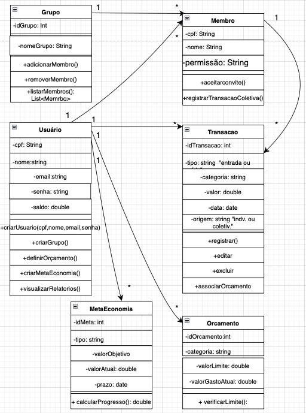

# Diagrama Estrutural do Sistema de Controle Financeiro

## Visão Geral

O diagrama estrutural representa a organização do sistema de forma estática, mostrando as **classes principais**, seus **atributos**, **métodos** e os **relacionamentos** entre elas.  
Ele foi criado para o projeto de **gestão de gastos e investimentos pessoais**, incluindo a funcionalidade de **grupos/famílias para administração coletiva de finanças.

---

## Classes Principais

### 1. Usuario
- **Atributos:** `cpf`, `nome`, `email`, `senha`, `saldo`  
- **Métodos:** `criarUsuario(cpf,nome,email,senha)`, `criarGrupo()`, `definirOrcamento()`, `criarMetaEconomia()`, `visualizarRelatorios()`  
- **Função:** Representa o usuário principal do sistema, que pode criar grupos, definir orçamentos, metas de economia e visualizar relatórios.  
- **Justificativa:** Centraliza as ações do usuário, garantindo controle individual e administração de grupos.

---

### 2. Grupo
- **Atributos:** `idGrupo`, `nomeGrupo`  
- **Métodos:** `adicionarMembro()`, `removerMembro()`, `listarMembros()`  
- **Função:** Representa um grupo ou família para administração coletiva de finanças.  
- **Relacionamentos:**  
  - 1 `Usuario` pode criar muitos `Grupo`  
  - Muitos `Membro` pertencem a um `Grupo`  
- **Justificativa:** Permite a gestão colaborativa de finanças, mantendo a estrutura organizada por grupos.

---

### 3. Membro
- **Atributos:** `cpf`, `nome`, `permissao` (admin, comum)  
- **Métodos:** `aceitarConvite()`, `registrarTransacaoColetiva()`  
- **Função:** Representa cada participante de um grupo.  
- **Ligação com Transacao:**  
  - Cada `Membro` pode registrar **Transacoes** (entradas e saídas de valores)  
  - Isso permite controlar financeiramente as contribuições e gastos individuais dentro do grupo.  
- **Justificativa:** Sem essa ligação, não seria possível monitorar nem contabilizar as finanças coletivas.

---

### 4. Transacao
- **Atributos:** `idTransacao`, `tipo` (entrada/saída), `categoria`, `valor`, `data`, `origem` (individual/coletiva)  
- **Métodos:** `registrar()`, `editar()`, `excluir()`, `associarOrcamento()`  
- **Função:** Registra todas as entradas e saídas de valores, tanto individuais quanto coletivas.  
- **Justificativa:** Essencial para acompanhar o fluxo de caixa e garantir que os orçamentos e metas sejam corretamente monitorados.

---

### 5. Orcamento
- **Atributos:** `idOrcamento`, `categoria`, `valorLimite`, `valorGastoAtual`  
- **Métodos:** `verificarLimite()`  
- **Função:** Permite definir limites de gastos por categoria e monitorar o consumo mensal.  
- **Justificativa:** Auxilia no controle financeiro e evita que os gastos ultrapassem os limites planejados.

---

### 6. MetaEconomia
- **Atributos:** `idMeta`, `tipo`, `valorObjetivo`, `valorAtual`, `prazo`  
- **Métodos:** `calcularProgresso()`  
- **Função:** Permite ao usuário definir objetivos de economia e acompanhar seu progresso ao longo do tempo.  
- **Justificativa:** Incentiva a disciplina financeira e facilita a visualização do cumprimento de metas.

---

## **Ligacao Membro -- Transacao?**

A ligação entre `Membro` e `Transacao` é **fundamental para o funcionamento do sistema**:  

- Cada membro do grupo pode **registrar suas próprias despesas ou receitas coletivas**, mantendo a transparência financeira.  
- Permite que o sistema **diferencie gastos individuais e coletivos**, associando cada transação ao responsável.  
- Isso garante que os **orçamentos e metas de economia** possam ser calculados corretamente, tanto para o grupo quanto para cada membro.

---

## **Conclusão**

O diagrama estrutural mostra como as classes se relacionam e colaboram para o funcionamento do sistema.  
A organização das classes permite:  

- Controle individual (`Usuario`)  
- Gestão colaborativa (`Grupo` e `Membro`)  
- Registro detalhado de transações (`Transacao`)  
- Planejamento financeiro (`Orcamento` e `MetaEconomia`)  

Essa estrutura garante **clareza, organização e escalabilidade**, facilitando a implementação e manutenção do projeto.

