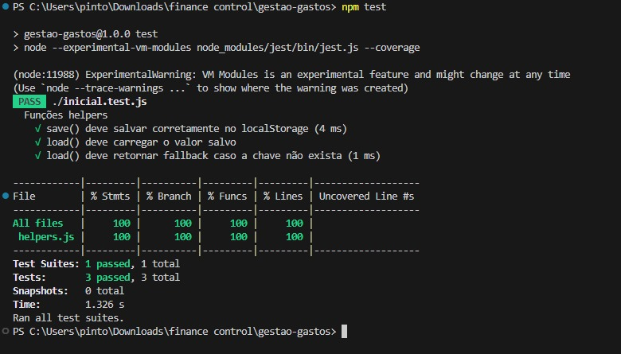
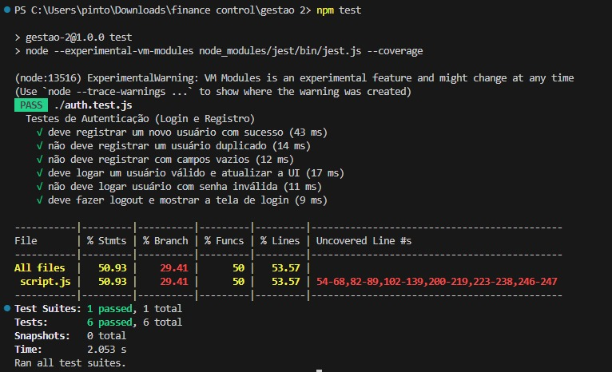

# Explicação Completa dos Testes — Helpers e Autenticação

Detalhamento dos conjuntos de testes:

1. **Testes das funções helpers (`save` e `load`)**
2. **Testes de Autenticação (registro, login, logout e manipulação do DOM)**

# 1. Testes das Funções Helpers (save/load)

Esses testes garantem que o sistema de armazenamento usando `localStorage` funcione corretamente, mesmo sem navegador, pois o Jest roda no Node.

## 1.1 Por que existe um mock do localStorage?

O ambiente Node não possui `localStorage`.  
Por isso, criamos uma simulação:

- `getItem()` → lê um valor
- `setItem()` → salva um valor
- `clear()` → limpa tudo
- Armazenamento feito dentro de um objeto JavaScript normal

Isso permite testar como suas funções interagem com o armazenamento real, mas sem depender do navegador.

## 1.2 Como funciona o teste do save()

1. Chama save("key", { objeto })
2. Lê o que foi salvo usando o mock
3. Verifica se o objeto salvo é exatamente o esperado

Garantindo que `JSON.stringify()` está sendo usado corretamente, a chave correta está sendo salva  e´não há alteração no conteúdo durante o processo  

## 1.3 Como funciona o teste do load()

### a) Quando a chave existe
O teste:
- pré-salva um valor no mock,
- chama `load(key)`  
- verifica se o valor retornado é o mesmo objeto

### b) Quando a chave não existe
A função deve retornar o **fallback** definido no teste. Isso garante que a função é segura e evita erros quando a chave não está salva.

# 2. Testes de Autenticação (Registro / Login / Logout)

Verificam:

- manipulação de usuários no localStorage  
- mensagens exibidas ao usuário (`alert`)  
- comportamento da interface (DOM)  
- fluxo completo de registro → login → logout  

## 2.1 Mocks utilizados

### a) Mock do localStorage
Mesmo mock do teste anterior, mas incluindo `removeItem()` para permitir logout.

### b) Mock de `alert` e `confirm`
O Jest não possui `alert`, então criamos:

- `global.alert = jest.fn()` → captura mensagens exibidas
- `global.confirm = jest.fn(() => true)` → simula sempre "OK"

Isso permite testar:
- mensagens exibidas  
- decisões condicionais que dependem de confirm()  

## 2.2 Simulação do DOM

O arquivo `index.html` é lido e colocado dentro de document.body.innerHTML = html;

Assim, os testes conseguem acessar:

- inputs de nome e senha  
- área de boas-vindas  
- telas (login-screen e app-screen)  

# 2.3 Testes de Registro

### a) Registro bem-sucedido
O teste verifica:
- usuário salvo  
- alert exibido  
- campos limpos  

### b) Registro de usuário duplicado
Verifica:
- não adiciona outro usuário igual  
- alerta correto  

### c) Campos vazios
Verifica:
- não salva  
- alerta mostrado  

# 2.4 Testes de Login

### a) Login válido
- salva o usuário atual  
- limpa inputs  
- esconde a tela de login  
- mostra a tela do app  
- mostra mensagem de boas-vindas  

### b) Login inválido
- não salva o usuário  
- mensagem de erro exibida  
- tela continua no login  

# 2.5 Teste de Logout
- remove `usuarioAtual`  
- esconde o app  
- volta para tela de login  

# Resumo

- localStorage funcionando corretamente, com fallback seguro.
- registro
- login
- logout
- tratamento de erros
- atualização da interface
- Testes funcionam sem navegador real.

